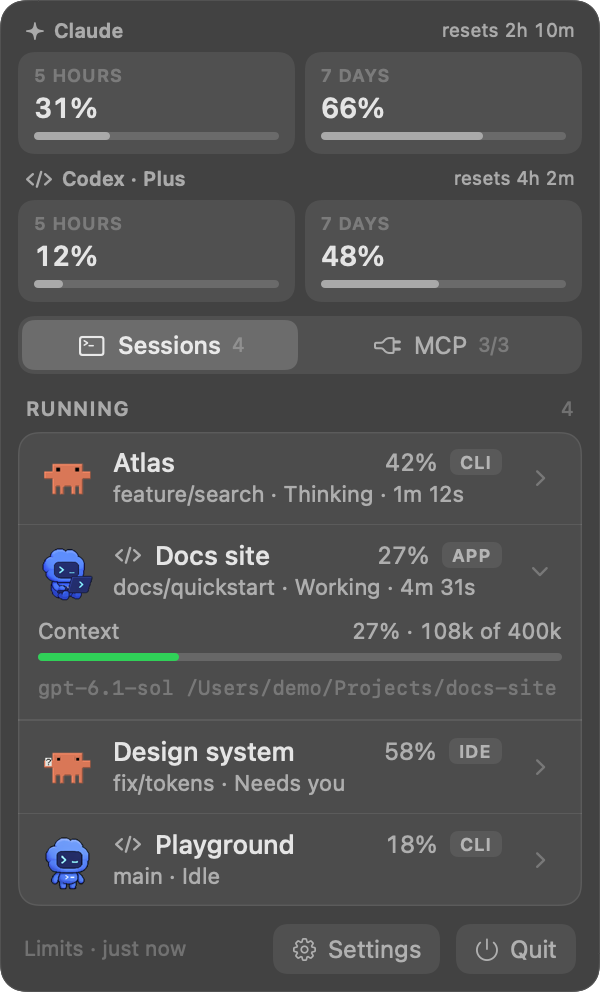
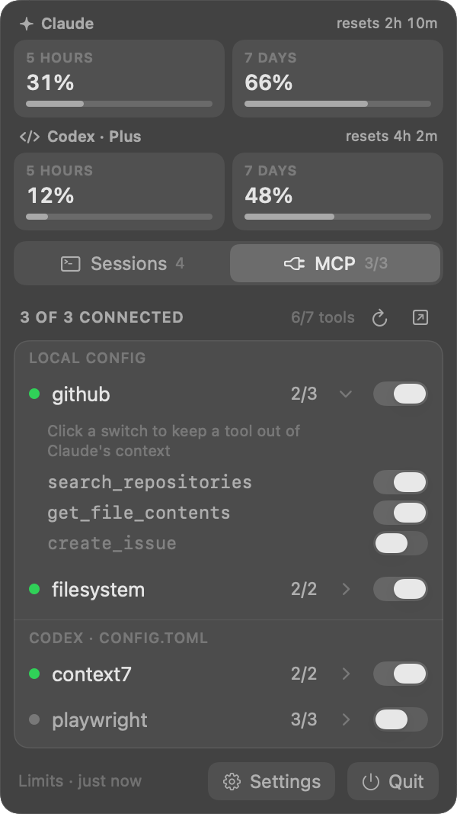
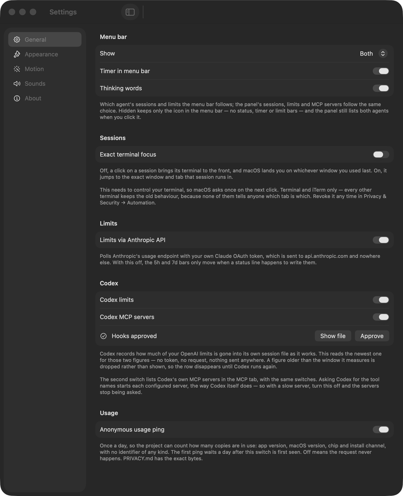
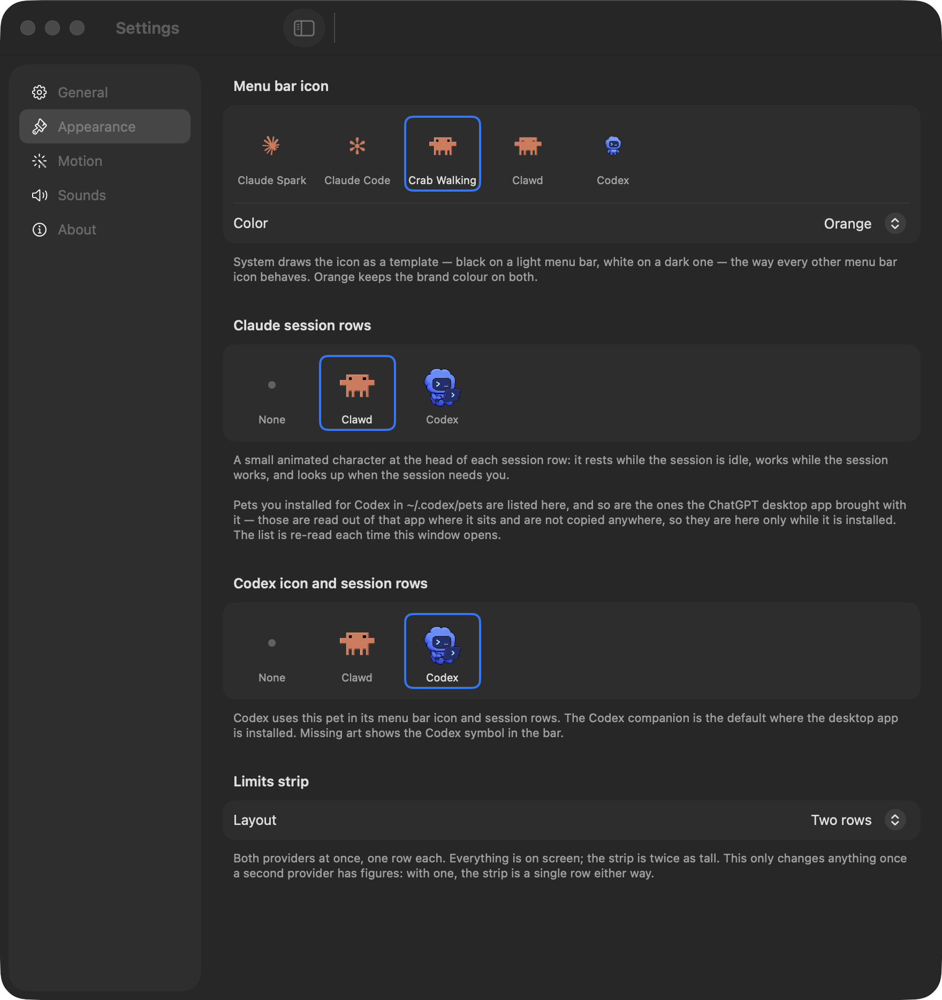
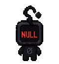

# Agent Control Bar

English | [Русский](README.ru.md)

https://github.com/user-attachments/assets/f44cc709-94be-40b7-88b3-2d2d4231e837

A macOS menu bar app for Claude Code and OpenAI Codex. See which sessions are working, which need your answer, and how much context and usage allowance they have used. Open the panel to jump to a session or switch MCP servers and tools on or off.


With **Both** selected, Claude and Codex each get a block in the menu bar. Their status, timer and limits are independent; clicking either opens the same panel.

The screenshots use demo sessions and example values from the current `main` build. A DMG contains the features of its published release; newer source changes need a new release.

## Install

You need macOS 13+, Node.js and the system `/usr/bin/python3`, plus Claude Code or Codex. The plugin needs Claude Code and Xcode Command Line Tools. The DMG is already compiled and works with a Codex-only setup.

The plugin command and DMG filename still use `claude-control-bar`. Existing installations keep their settings. If your installed copy is still named `Claude Control Bar.app`, use that name in the commands below.

### Claude Code plugin

Run these commands inside Claude Code:

```bash
/plugin marketplace add InfinityScripter/agent-control-bar
```

```bash
/plugin install claude-control-bar
```

The next session start builds the app on your Mac. Install the Command Line Tools with `xcode-select --install` if needed; the first build can take a few minutes. Plugin updates come through Claude Code.

### DMG

1. Download `claude-control-bar.dmg` from [the latest release](https://github.com/InfinityScripter/agent-control-bar/releases/latest).
2. Drag Agent Control Bar into Applications.
3. Launch it once to install its hooks, then start a new Claude Code or Codex session.

The DMG is not notarized. If macOS blocks the first launch, open **System Settings → Privacy & Security → Open Anyway**, or run:

```bash
xattr -dr com.apple.quarantine "/Applications/Agent Control Bar.app"
```

Choose one install channel. The plugin takes ownership of the hooks if both are present.

## First session

Look for the icon near the clock in the menu bar. Click it to open **Sessions** and **MCP**; limits stay above both tabs. Click **Settings** at the bottom or press ⌘, to open settings. The app has no Dock icon unless that window is open.

Session hooks start the app automatically. It stays open while it detects active sessions or agent processes, or while its panel or settings are open. A manual launch with no active session may close again after installing the hooks.

Start a new session after installation. An existing Claude Code session may appear after its next prompt or tool call. For a plugin install, let the first build finish before looking for the icon. Build failures are recorded in `~/.claude/control-bar/problems.log`.

### Approve the Codex hooks

Installation adds eight hooks to `~/.codex/hooks.json` and preserves your other entries. Codex requires approval before it runs them. Until then, the bar cannot receive Codex session state, and the panel shows a hook notice. Codex still writes its own session files.

Click **Approve** in that notice or in **Settings → General → Codex**. You can also approve the hooks in Codex's own review screen. **What gets approved** reveals `~/.codex/hooks.json` so you can inspect the commands first. The app asks Codex to approve only its own entries, and only after your click.

**Settings → About → Install hooks again** repairs the installation; approval is a separate step. To remove the hooks, use the [uninstall instructions](#uninstall) below.

<details>
<summary>What the Codex hooks do</summary>

The hooks run two local scripts, `~/.claude/control-bar/update.js` and `lifecycle.js`, on session start/end, prompts, tool calls, permission requests, stop and interrupt events.

| Action | Scope |
| --- | --- |
| Read | The hook payload and the head/tail of that session's rollout file for its surface and token counts. |
| Write | Small state files and diagnostic markers under `~/.claude/control-bar/codex/`. |
| Run | `git status --porcelain` for the uncommitted-file count, `pgrep` to check the app, and `open -g -b …` to start it. |
| Send | No network requests. The scripts use Node's built-in modules, without npm dependencies. |

More on local files and permissions: [PRIVACY.md](PRIVACY.md).

</details>

## Read and open sessions



The yellow dot marks a session waiting for permission or an answer. Expand a row for model and context details. Codex keeps the complete model identifier, such as `gpt-6.1-sol`.

| State | What you see |
| --- | --- |
| Idle | A resting icon or pet. |
| Thinking or running a tool | An animated icon, current activity and elapsed turn time. |
| Needs you | A yellow dot and a waiting icon or pet. |

Each row shows its project and branch, turn timer and context usage when available. The timer belongs to the current turn, not the whole session. Turning **Timer in menu bar** off leaves the row timers visible.

Click a row to return to its terminal or editor. Codex desktop sessions open their conversation through a `codex://threads/` link when available. By default, a terminal click brings its app forward. **Settings → General → Exact terminal focus** targets the session's window and tab in Terminal or iTerm; it is off by default and requires macOS Automation permission.

## Usage limits

The bars show the percentage used. Claude's limits include its 5-hour and 7-day windows, plus a separate Fable weekly window on plans that report one. Reset times appear in the panel. Codex reports its own window lengths; they are not always a 5-hour/week pair.

Codex can report an ordinary pool and a reserve pool. The menu bar prefers the ordinary pool. If only reserve figures are available, it uses them and identifies the fallback in the tooltip. The panel lists all reported pools. A provider with no usable figures gets no limit bars; it does not inherit the other provider's numbers.

After a recorded reset time passes, that window shows zero used until the next measurement, with no old reset countdown. Codex snapshots without enough timing information are omitted.

In **Settings → Appearance → Limits strip**, **Two rows** shows both providers together. **Switcher** gives one provider the full width; the other remains behind its tab, with a thin usage indicator under the name.

Claude figures come from Anthropic's usage API using the OAuth token Claude Code stores locally. Turn **Limits via Anthropic API** off in General to stop the poll. Codex figures are read from local rollout files in `~/.codex/sessions`; **Codex limits** stops that read. No OpenAI token or API request is needed for them.

## Switch MCP servers and tools



Expand a server to see its tools. Each server and tool has a switch, so you can keep a server available while disabling tools you do not use. Claude and Codex appear in separate groups.

Claude Code picks up tool changes in new sessions. Codex changes are saved to its MCP configuration; if a current conversation keeps the old tool list, start a new session.

**Check MCP now** (⌘R) refreshes health and tool counts. **Open settings.json** opens Claude's settings file. Claude switches are saved there with backups; Codex switches update its own MCP configuration.

Health checks start configured MCP servers to ask for their tools. Remote servers may receive connections. If Codex server discovery is slow, turn **Codex MCP servers** off in General. The app sends macOS notifications when a server goes down or comes back; a **Notifications are off** notice opens the relevant System Settings page.

## Choose what stays in the menu bar



**Settings → General → Show** controls the menu bar and the panel's contents:

| Show | Result |
| --- | --- |
| Claude Code | Claude's icon, status, timer and limits; Claude sessions and MCP servers in the panel. |
| Codex | The same controls for Codex. |
| Both | Two independent blocks in one menu bar item, with both agents in the shared panel. |
| Hidden | An icon-only launcher. The panel and sounds still cover both agents. |

Before you choose a mode, the app includes Codex when it is installed. **Thinking words** replaces *Thinking…* with Claude Code's spinner verbs, such as *Manifesting…*. Both blocks follow the timer and wording preferences.

The settings window has five pages: General, Appearance, Motion, Sounds and About. General also holds the limits, MCP discovery, hook approval and anonymous-ping controls. About has update checks and hook repair.

## Icons, pets and sounds



Pick Claude's icon in **Settings → Appearance → Menu bar icon**: Crab Walking, Claude Spark, the Claude Code spinner or a pet. **Color** offers Orange or System; pets keep their own colors. The separate **Session rows** chooser controls Claude's row icons. **Codex icon and session rows** chooses the companion for both Codex's menu bar block and its rows. **None** restores the plain row indicators.

The default crab counts working sessions: it sleeps at zero, has a cigar at one, walks at two or three, sweats at four or five, and catches fire at six or more. Idle sessions do not count. When a session needs you, it holds up a question-mark sign. Pets show three states: resting, working and waiting.

Clawd, the crab, comes with the app. The chooser also finds pets in `~/.codex/pets` and companions bundled with Codex or ChatGPT desktop apps. Reopen Settings after adding a pet; no restart is needed. If selected artwork disappears, Claude's menu bar icon falls back to the crab and Codex's to its glyph; the selection is kept.

<details>
<summary>Crab animation previews</summary>

These GIFs use the app's animation frames and timing.

| Sleeping | One working session | Two or three |
| :---: | :---: | :---: |
|  |  |  |
| Four or five | Six or more | Needs you |
|  |  |  |

</details>

<details>
<summary>Companion previews and custom pets</summary>

These previews show a selection of Codex companions. Each cycles through resting, working and waiting.

| Codex | BSOD | Dewey |
| :---: | :---: | :---: |
|  |  |  |
| Fireball | Hoots | Null Signal |
|  |  |  |
| Rocky | Seedy | Stacky |
|  |  |  |

Community galleries: [awesome-codex-pets](https://github.com/BeiXiao/awesome-codex-pets) and [petdex](https://petdex.dev).

For a custom pet, put `pet.json` and a transparent PNG or WebP sprite sheet in `~/.codex/pets/<name>/`. Cells are 192 × 208, with eight columns. Accepted sheet sizes are 1536 × 1872 (nine rows) and 1536 × 2288 (eleven rows); other sizes are skipped. Rows describe idle, right/left movement, waving, jumping, failure, waiting, working and review. [tools/pet-sheet](tools/pet-sheet) builds Clawd's sheet as an example.

</details>

**Motion** controls panel transitions and session-row pets. Off stops those animations, Subtle (default) animates controls, and Expressive adds row entrances. macOS Reduce Motion limits movement and leaves panel pets still. Menu-bar status animations keep running; panel pets animate only while the panel is open.

In **Sounds → When a turn finishes**, choose a chime after every turn or only after turns longer than 1, 5 or 15 minutes; it is off by default. **When Claude needs you** controls the attention sound for both agents. That sound stays quiet when the session's terminal or app is already in front. Choose Off, Tink, Purr, Ping, Glass, Hero or Submarine; selecting a sound plays a preview.

Sounds follow the **Show** selection. Both and Hidden cover both agents.

## Privacy

Session state, context figures and Codex limits are read locally. The app does not send your conversations or project paths to the developer. The hooks make no network requests.

The app itself checks for updates, can poll Anthropic for Claude usage, and can connect to your configured MCP servers. Its anonymous usage ping is on by default: at most once a day, starting 24 hours after the first launch. It contains the app version, macOS major version, CPU architecture and install channel, with no device identifier. Turn **Anonymous usage ping** off in General, or set `CONTROL_BAR_NO_ANALYTICS` in the app's environment to any value.

[PRIVACY.md](PRIVACY.md) lists the network requests, local files, permissions and debug-log behavior.

## Updates and Claude Code commands

Plugin installs update through Claude Code. For a DMG install, click the panel's **Update available** card, read the release notes, then choose **Download and install**. The app verifies the download's GitHub SHA-256 digest before replacing itself and restarting. **Settings → About → Check now** checks manually. Release history is in [CHANGELOG.md](CHANGELOG.md).

The plugin adds these commands inside Claude Code:

- `/mcp-health` prints server health, tool counts, disabled tools, session context and limits.
- `/limits-capture install|uninstall|status` optionally wraps your `statusLine` command to read the limits Claude Code supplies. `uninstall` restores the previous command.

## Uninstall

For a plugin install, run `/plugin uninstall claude-control-bar`, then move `~/Applications/Agent Control Bar.app` to the Trash.

For a DMG install, remove the hooks first:

```bash
node "/Applications/Agent Control Bar.app/Contents/Resources/uninstall.js"
```

Then move the app to the Trash. If you installed it elsewhere, adjust the command's path. The script preserves other hooks and restores your previous `statusLine` command when possible. It does not delete the app or its data folder, `~/.claude/control-bar/`.

## If the icon is missing

Run `pgrep -x ClaudeControlBar`. A PID means the app is running; check whether other menu bar items leave it enough room. No output means it is not running: start a new session and check `~/.claude/control-bar/problems.log`. For Codex, also check hook approval in General.

More fixes, layout controls and diagnostics: [TROUBLESHOOTING.md](TROUBLESHOOTING.md).

## Credits and license

Agent Control Bar grew out of [claude-status-bar](https://github.com/m1ckc3s/claude-status-bar) by Mick Cesanek and [claude-mcp-bar](https://github.com/InfinityScripter/claude-mcp-bar). See [ACKNOWLEDGEMENTS.md](ACKNOWLEDGEMENTS.md) for contributors.

Released under the [MIT license](LICENSE). This is an unofficial project, unaffiliated with Anthropic or OpenAI. "Claude" is a trademark of Anthropic.
